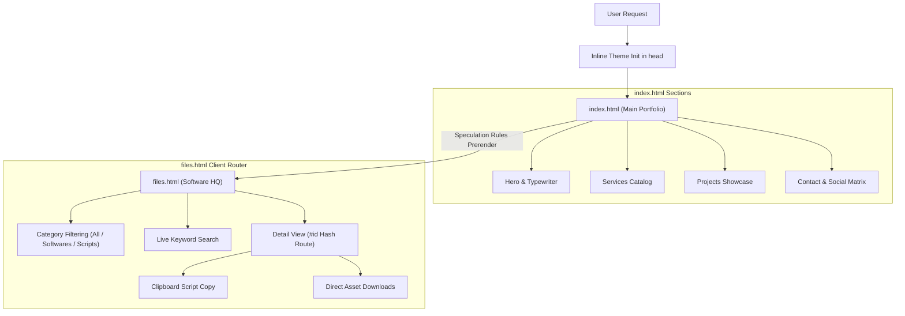
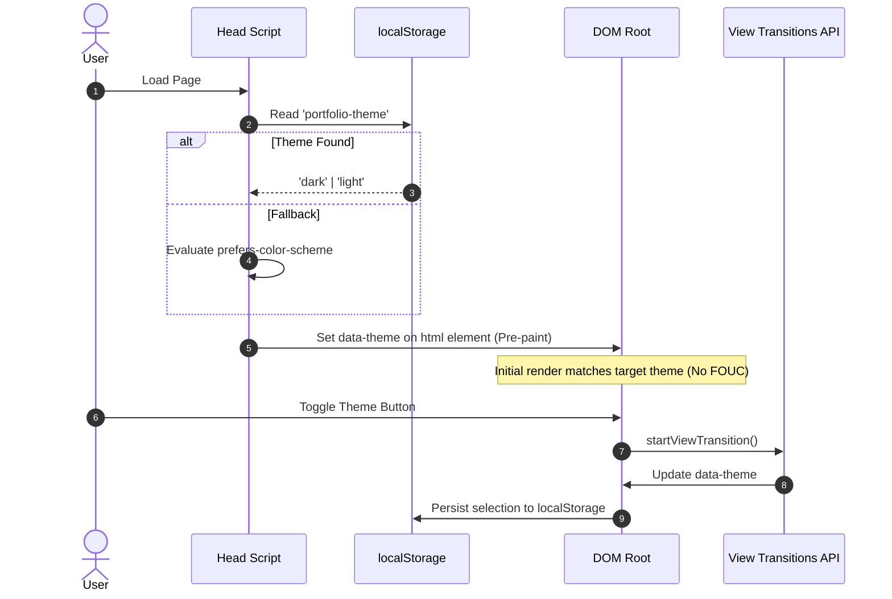
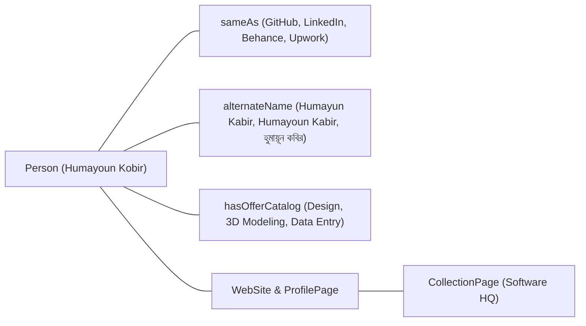

# Humayoun Kobir - Portfolio & Software HQ

[](https://humayounkobir.vercel.app/)
[](https://developer.mozilla.org/)
[](LICENSE)

Source repository for the personal portfolio of **Humayoun Kobir** (Humayun Kabir / হুমায়ূন কবির) — Computer Science Diploma Engineer, Graphic Designer, and Hardware Specialist based in Bangladesh.

The repository includes two core surfaces:
1. **Main Portfolio (`index.html`)**: Personal background, professional services, creative project showpieces, and contact channels.
2. **Software HQ (`files.html`)**: An interactive, search-enabled utility directory and command hub for PC optimization tools, hardware diagnostics, and Windows maintenance scripts.

---

## Table of Contents

- [Overview](#overview)
- [Architecture & Flow](#architecture--flow)
- [Technical Features](#technical-features)
- [Software HQ Catalog](#software-hq-catalog)
  - [System Optimization & Maintenance](#system-optimization--maintenance)
  - [Hardware Monitoring & Diagnostics](#hardware-monitoring--diagnostics)
  - [Data Recovery & Storage](#data-recovery--storage)
  - [Design & Typography Tools](#design--typography-tools)
  - [Windows Tweaks & Registry](#windows-tweaks--registry)
  - [Productivity & Language](#productivity--language)
- [Quick Maintenance Commands](#quick-maintenance-commands)
- [Performance & Edge Rules](#performance--edge-rules)
- [Schema & Entity Resolution](#schema--entity-resolution)
- [Project Structure](#project-structure)
- [Running Locally](#running-locally)
- [Contact](#contact)

---

## Overview

The site is built with pure Vanilla web technologies (HTML5, CSS3, ES6+ JS) without build steps, bundlers, or heavy framework runtimes. This keeps cold loads fast, minimizes memory consumption on low-end devices, and allows direct deployment to static hosts.

| Endpoint | File | Purpose |
| :--- | :--- | :--- |
| `https://humayounkobir.vercel.app/` | `index.html` | Profile, design showcase, service breakdown, social connections |
| `https://humayounkobir.vercel.app/files.html` | `files.html` | Interactive software library, deep links, one-click script copy |

---

## Architecture & Flow

The site operates as a multi-page setup connected via Chromium Speculation Rules for near-zero latency page switches, while `files.html` uses client-side hash routing for its sub-views.



### Theme State & View Transition Sequence



---

## Technical Features

- **Theme Engine**: Light theme (`#ffffff` / `#165844` accent) and dark theme (`#070707` / `#ff6b00` accent) handled through CSS custom properties. Supported browsers use the native View Transitions API for smooth morphing.
- **Pre-paint Theme Synchronization**: Small inline script executes in `<head>` before the DOM is rendered to prevent flashes of unstyled content (FOUC).
- **Glider Navigation**: Scroll position is computed against section boundaries using `requestAnimationFrame` loops on desktop, driving a floating glider highlight behind active navigation links.
- **Speculation Rules Prerendering**: Chromium-based browsers preload and prerender `files.html` from `index.html` (and vice versa) for instant page transitions.
- **Adaptive Mobile Mode**: Continuous scroll animations and expensive background blur filters are disabled for screen widths below 1024px to preserve battery life and maintain 120 FPS on mobile devices.
- **Client-Side Hash Router**: `files.html` listens to `hashchange` and `popstate` events to render dedicated detail pages (`#cdi`, `#pc-opt`, `#hwinfo`) with full browser history support.

---

## Software HQ Catalog

A categorized breakdown of software, diagnostic utilities, scripts, and creative suites hosted or referenced in the repository.

### System Optimization & Maintenance

| Item | Type / License | Asset / Source | Notes |
| :--- | :--- | :--- | :--- |
| **Autoruns** | Freeware (Microsoft Sysinternals) | `assets/Autoruns/Autoruns.rar` | Deep startup program, service, driver, and scheduled task manager. |
| **Process Explorer** | Freeware (Microsoft Sysinternals) | `assets/ProcessExplorer/PE.rar` | Detailed task manager showing handles, DLLs, and per-process hardware stats. |
| **Process Monitor** | Freeware (Microsoft Sysinternals) | `assets/ProcessMonitor.zip` | Real-time tracking of file system, registry, and thread activity. |
| **Glary Utilities Pro** | Software (Key included) | `assets/Glary Utility/Glary_Utilities_v5.211.0.240.exe` | System maintenance suite with registry repair, disk cleanup, and startup tools. |
| **Revo Uninstaller Pro** | Software (Patched) | `assets/Revo Uninstaller Pro 5.4.3 FINAL/Revo Uninsataller.rar` | Deep uninstaller that cleans remnant files and registry keys after standard uninstall. |
| **HitmanPro Scanner** | Freeware / Cloud Scanner | `assets/HitmanPro_3.8.28_Build_324/HitmanPro 3.8.rar` | Secondary cloud-based malware, rootkit, and trojan scanner. |
| **Good Bye DPI** | Open Source (FOSS) | `assets/Good Bye DPI/goodbyedpi-0.2.2.rar` | Deep Packet Inspection bypass utility for censored or throttled networks. |
| **WinRAR Pro** | Shareware (License key provided) | `assets/Winrar/rarreg.rar` | Archive manager with license key (`rarreg.key`). 7-Zip is also recommended as a FOSS alternative. |
| **Visual C++ Runtimes AIO** | Redistributable Pack | `assets/Visual C++ Runtimes All-in-One-Jun-2026.zip` | Single installer covering Microsoft Visual C++ runtimes from 2005 to 2022 (x86 & x64). |
| **DirectX 11 Setup** | Microsoft Runtime | `assets/DirectX 11 Setup.rar` | DirectX runtime libraries required for 3D apps and games. |

### Hardware Monitoring & Diagnostics

| Item | Type / License | Asset / Source | Notes |
| :--- | :--- | :--- | :--- |
| **CrystalDiskInfo (CDI)** | Open Source / Freeware | `assets/CrystalDiskInfo/CDI.rar` | Storage drive health monitoring and S.M.A.R.T. telemetry. |
| **CrystalDiskMark (CDM)** | Open Source / Freeware | `assets/CrystalDiskMark/CDM.rar` | Sequential and random read/write storage benchmark utility. |
| **HWiNFO** | Freeware | Official Mirror Link (`hwinfo.com`) | In-depth hardware telemetry: temperatures, voltages, clock speeds, and fan curves. |
| **Custom Resolution Utility (CRU)** | Freeware (ToastyX) | `assets/cru-1.5.3/CRU.rar` | EDID manager to configure custom display resolutions and refresh rates. |
| **BIOS Enter Button** | Batch Utility | `assets/BIOS enter button/One click to Bios.rar` | One-click reboot directly into motherboard UEFI/BIOS firmware. |

### Data Recovery & Storage

| Item | Type / License | Asset / Source | Notes |
| :--- | :--- | :--- | :--- |
| **EaseUS Data Recovery** | Software (Technician v12.8) | `assets/EaseUS_Data_Recovery_Wizard_Technician_...` | File recovery for formatted, deleted, or RAW partitions. |
| **EaseUS Partition Master** | Software (Technician v13.0) | `assets/EaseUS_Partition_Master_13.0_...` | Partition resizing, 4K alignment, MBR-to-GPT conversion, and disk cloning. |
| **Picture Recovery (PhotoRec)** | Open Source (GPL) | `assets/Picture Recovery Software/testdisk-7.3-WIP.rar` | File carving tool for recovering photos, documents, and media from corrupted storage. |

### Design & Typography Tools

| Item | Type / License | Asset / Source | Notes |
| :--- | :--- | :--- | :--- |
| **Adobe Photoshop CC 2020** | Creative Suite (Repack) | Mirror Guide | Raster editing, photo manipulation, and UI graphic assets. |
| **Adobe Illustrator CC 2020** | Creative Suite (Repack) | Mirror Guide | Vector graphic design for logos, brand identity, and illustrations. |
| **FontLab** | Typeface Design Suite | `assets/FontLab.rar` | Typography software to create, edit, and export custom OpenType and Web fonts. |
| **Foxit PDF Editor** | PDF Suite | `assets/Foxit pdf editor.rar` | Document management tool to edit text, merge files, and sign PDF forms. |

### Windows Tweaks & Registry

| Item | Type / License | Asset / Source | Notes |
| :--- | :--- | :--- | :--- |
| **Win10 Menu on Win11** | Registry Patch | `assets/Windows 10 Right click menu/...` | Restores classic Windows 10 context menus in Windows 11. |
| **Win11 Rounded Cursors** | Custom Asset | `assets/Windows 11 rounded Cursor/...` | High-DPI rounded cursor theme for Windows. |
| **Context Menu Registry Path** | Text Reference | `assets/Registry path of context menu.txt` | Direct registry path for custom context menu entries. |
| **Right Click Repair Code** | Shell GUID | `assets/Right click repair code.txt` | Direct GUID string for Windows Explorer right-click behavior. |

### Productivity & Language

| Item | Type / License | Asset / Source | Notes |
| :--- | :--- | :--- | :--- |
| **Avro Keyboard** | Open Source (OmicronLab) | `assets/Avro/setup_avrokeyboard_5.6.0.exe` | Standard phonetic Bangla typing software supporting Unicode and ANSI layouts. |

---

## Quick Maintenance Commands

Software HQ includes quick copy-paste commands for system maintenance via Administrator PowerShell:

```powershell
# 1. Chris Titus Tech Windows Utility (Debloat, tweaks, package installs)
irm "https://christitus.com/win" | iex

# 2. Microsoft Activation Scripts (MAS)
irm https://get.activated.win | iex

# 3. Disable Dynamic Tick (Fix timer latency and frame pacing stutters)
bcdedit /set disabledynamictick yes

# 4. Enable Ultimate Performance Power Plan
powercfg -duplicatescheme e9a42b02-d5df-448d-aa00-03f14749eb61

# 5. Run System File Checker (SFC)
sfc /scannow

# 6. DISM Component Store Health Restoration
DISM.exe /Online /Cleanup-image /Restorehealth

# 7. Check Drive Hardware Health via WMIC
wmic Diskdrive get status
```

---

## Performance & Edge Rules

- **CSS Layout Containment**: Below-the-fold sections use `content-visibility: auto` with `contain-intrinsic-size` to skip initial render calculation until scrolled into view.
- **Font Optimization**: Google Font `Manrope` is loaded with character-range subsetting (`&text=...`), reducing the initial font payload by ~80%.
- **Vercel Edge Rules**: Configured in `vercel.json`:
  - Static assets under `/assets/` have `Cache-Control: public, max-age=31536000, immutable`.
  - Global headers enforce `X-Content-Type-Options: nosniff`, `X-Frame-Options: SAMEORIGIN`, and `Referrer-Policy: strict-origin-when-cross-origin`.

---

## Schema & Entity Resolution

The homepage embeds structured JSON-LD data to link name variations and services for search indexing:



---

## Project Structure

```
Webpage-2/
├── assets/                     # Downloadable utilities, scripts, icons & media
│   ├── site-images/            # WebP graphics, brand banners & animated logo
│   ├── Autoruns/               # Sysinternals Autoruns archive
│   ├── Avro/                   # Avro keyboard setup
│   ├── CrystalDiskInfo/        # CDI health monitoring archive
│   ├── CrystalDiskMark/        # CDM benchmark archive
│   ├── Glary Utility/          # Glary Utilities installer
│   ├── Good Bye DPI/           # GoodByeDPI utility
│   ├── HitmanPro_.../          # HitmanPro scanner archive
│   ├── ProcessExplorer/        # Process Explorer archive
│   ├── Revo Uninstaller.../    # Revo Uninstaller Pro archive
│   ├── Winrar/                 # WinRAR activation key package
│   ├── cru-1.5.3/              # Custom Resolution Utility
│   └── ...                     # Additional scripts, runtimes & tools
├── BingSiteAuth.xml            # Bing Webmaster verification
├── files.html                  # Software HQ interactive utility explorer
├── google066fec538eede997.html # Google Search Console verification
├── index.html                  # Main portfolio homepage
├── README.md                   # Repository documentation
├── robots.txt                  # Search crawler directives
├── script.js                   # Navigation glider, theme switcher, typing animation
├── site.webmanifest            # Web manifest configuration
├── sitemap.xml                 # XML Sitemap for search engines
├── style.css                   # Global styling, tokens, themes & layout rules
└── vercel.json                 # Vercel deployment headers and cache rules
```

---

## Running Locally

No package managers, compilers, or build steps are required.

### Static File Server
Clone the repository and open `index.html` with any local HTTP server:

```bash
# Clone repository
git clone https://github.com/humayunk45423/Webpage-2.git

# Serve using Python 3
cd Webpage-2
python -m http.server 8080
```

Open `http://localhost:8080` in your web browser.

---

## Contact

- **Email**: [humayunk45423@gmail.com](mailto:humayunk45423@gmail.com)
- **WhatsApp**: [+8801721445207](https://wa.me/8801721445207)
- **GitHub**: [github.com/humayunk45423](https://github.com/humayunk45423)
- **LinkedIn**: [linkedin.com/in/humayounkobir](https://www.linkedin.com/in/humayounkobir/)
- **Behance**: [behance.net/humayunk45423](https://www.behance.net/humayunk45423)
- **Dribbble**: [dribbble.com/humayunk45423](https://dribbble.com/humayunk45423)
- **Upwork**: [Freelancer Profile](https://www.upwork.com/freelancers/~019f94538da41f401d)
