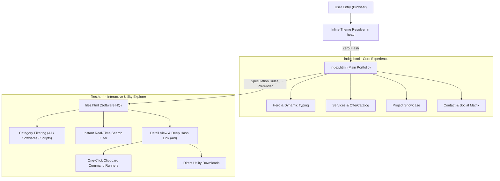
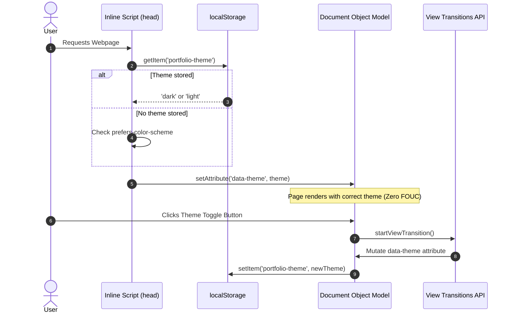
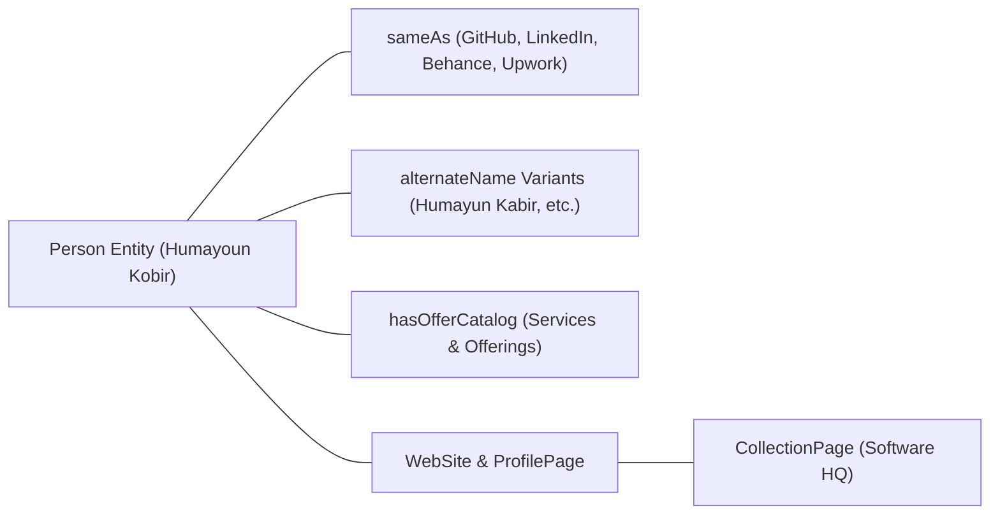

# 🌟 Humayoun Kobir | Official Portfolio & Software HQ

[](https://humayounkobir.vercel.app/)
[](LICENSE)
[](https://developer.mozilla.org/)
[](#-performance--engineering-highlights)
[](#-seo--semantic-architecture)

> **Welcome to the official repository of Humayoun Kobir (Humayun Kabir / হুমায়ূন কবির)** — Computer Science Diploma Engineer, Graphic Designer, 3D Visualizer, and Hardware Enthusiast based in Bangladesh.
> 
> This repository houses both a **blazing-fast, zero-dependency personal portfolio** and **Software HQ**, an interactive web-based curation hub of essential PC optimization tools, diagnostic utilities, creative suites, and Windows scripts.

---

## 📑 Table of Contents

- [🌐 Live Deployment](#-live-deployment)
- [🏗️ System Architecture & Navigation Flow](#️-system-architecture--navigation-flow)
- [✨ Key Features & Technical Highlights](#-key-features--technical-highlights)
- [🗂️ Software HQ: Curated Utility Directory](#️-software-hq-curated-utility-directory)
  - [1. 🛡️ System Optimization, Maintenance & Utilities](#1-️-system-optimization-maintenance--utilities)
  - [2. 🔍 Hardware Monitoring & Diagnostics](#2--hardware-monitoring--diagnostics)
  - [3. 💾 Data Recovery & Storage Management](#3--data-recovery--storage-management)
  - [4. 🎨 Creative, 3D & Design Tools](#4--creative-3d--design-tools)
  - [5. ⚡ Windows Tweaks, Registry & Customization](#5--windows-tweaks-registry--customization)
  - [6. ⌨️ Language & Productivity](#6-️-language--productivity)
- [💻 One-Click Windows Optimization Commands](#-one-click-windows-optimization-commands)
- [⚡ Performance & Engineering Highlights](#-performance--engineering-highlights)
- [🔍 SEO & Semantic Entity Resolution](#-seo--semantic-entity-resolution)
- [📁 Repository Structure](#-repository-structure)
- [🚀 Local Development & Setup](#-local-development--setup)
- [📫 Contact & Social Profiles](#-contact--social-profiles)

---

## 🌐 Live Deployment

| Page | URL | Purpose |
| :--- | :--- | :--- |
| **Main Portfolio** | [humayounkobir.vercel.app](https://humayounkobir.vercel.app/) | Personal profile, services, creative portfolio, and contact portal. |
| **Software HQ** | [humayounkobir.vercel.app/files.html](https://humayounkobir.vercel.app/files.html) | Interactive tool explorer, diagnostic downloads, and copy-paste script hub. |

---

## 🏗️ System Architecture & Navigation Flow

The application is structured as a high-performance **Multi-Page Application (MPA)** with **Client-Side Hash Routing** for sub-views, synchronized via **Chromium Speculation Rules** for instantaneous sub-millisecond page switches.



### 🎨 Theme State Machine & Zero-Flash Pipeline



---

## ✨ Key Features & Technical Highlights

1. **Pure Vanilla Power (Zero Framework Overhead)**:
   - Hand-crafted HTML5, modular CSS3, and modern Vanilla ES6+ JavaScript.
   - Ultra-small asset payload with no heavy React/Next.js/Vue runtimes.

2. **Smart Dual Theme (Vibrant Light & Sleek Dark)**:
   - **Light Mode**: Clean white background (`#ffffff`) with deep emerald green accent (`#165844`).
   - **Dark Mode**: OLED-friendly dark surface (`#070707`) with high-energy amber-orange accent (`#ff6b00`).
   - **Native Hardware View Transitions**: Smooth geometric morphing on modern browsers.

3. **Glider Scroll-Synced Navbar**:
   - Hardware-accelerated sliding glider pill in the navigation bar that dynamically syncs 1:1 with scroll position and section boundaries.

4. **Instantaneous Speculation Rules API**:
   - Modern Chromium `<script type="speculationrules">` prerenders subsequent pages in the background, achieving **0ms perceived latency** when clicking between the main portfolio and Software HQ.

5. **Client-Side Hash Router in Software HQ**:
   - Interactive detail pages with seamless `window.history.pushState` and `popstate` support (`#cru`, `#pc-opt`, `#adobe-suite`), allowing direct shareable links to any software card.

6. **Mobile-First High Frame Rate Tuning**:
   - Heavy background blur filters and continuous timer loops are automatically detached on mobile devices (`max-width: 1024px`) to preserve CPU battery life and maintain rock-solid **120 FPS**.

---

## 🗂️ Software HQ: Curated Utility Directory

**Software HQ** provides a categorized catalog of tools, utilities, scripts, and creative suites. Below is the comprehensive classification breakdown:

### 1. 🛡️ System Optimization, Maintenance & Utilities

| Software / Tool | License / Type | File Location | Description & Usage |
| :--- | :--- | :--- | :--- |
| **Autoruns** | 🟢 **Freeware (Microsoft Sysinternals)** | `assets/Autoruns/Autoruns.rar` | Shows all auto-starting programs, services, driver hooks, and scheduled tasks. Run `autoruns64.exe` as Administrator. |
| **Process Explorer** | 🟢 **Freeware (Microsoft Sysinternals)** | `assets/ProcessExplorer/PE.rar` | Advanced task manager showing file handles, DLL dependencies, CPU threads, and GPU consumption per process. |
| **Process Monitor** | 🟢 **Freeware (Microsoft Sysinternals)** | `assets/ProcessMonitor.zip` | Real-time monitoring of Windows file system, registry, and process/thread activity. |
| **Glary Utilities Pro** | 🔑 **Serial Key Included** | `assets/Glary Utility/Glary_Utilities_v5.211.0.240.exe` | All-in-one system optimizer with registry cleaner, disk cleaner, startup manager, and shortcut fixer. |
| **Revo Uninstaller Pro** | 🔧 **Technician / Patched** | `assets/Revo Uninstaller Pro 5.4.3 FINAL/Revo Uninsataller.rar` | Deep-level uninstaller that removes leftover files, temporary folders, and registry keys after standard uninstallations. |
| **HitmanPro Scanner** | ☁️ **Second-Opinion Cloud Scanner** | `assets/HitmanPro_3.8.28_Build_324/HitmanPro 3.8.rar` | Rapid cloud-based malware, rootkit, and trojan scanner that operates without conflicting with primary antivirus software. |
| **Good Bye DPI** | 🌐 **Free & Open-Source (FOSS)** | `assets/Good Bye DPI/goodbyedpi-0.2.2.rar` | Utility to bypass Deep Packet Inspection (DPI) censorship and network throttling without requiring a slow VPN. |
| **WinRAR Pro** | 📦 **Shareware / Patch Key Provided** | `assets/Winrar/rarreg.rar` | Industry standard RAR/ZIP compression tool. Includes registration key (`rarreg.key`) and recommendations for **7-Zip** (FOSS). |
| **Visual C++ Runtimes AIO** | 🧰 **Essential Runtimes Pack** | `assets/Visual C++ Runtimes All-in-One-Jun-2026.zip` | One-click batch installer containing all Microsoft Visual C++ redistributable packages (2005 to 2022, x86/x64). |
| **DirectX 11 Setup** | 🎮 **Microsoft Runtime** | `assets/DirectX 11 Setup.rar` | Full offline DirectX End-User Runtime installer for games and 3D rendering engines. |

---

### 2. 🔍 Hardware Monitoring & Diagnostics

| Software / Tool | License / Type | File Location / Link | Description & Usage |
| :--- | :--- | :--- | :--- |
| **CrystalDiskInfo (CDI)** | 🟢 **Open-Source / Freeware** | `assets/CrystalDiskInfo/CDI.rar` | Monitors HDD/SSD health status, power-on hours, temperature, and S.M.A.R.T. predictive failure indicators. |
| **CrystalDiskMark (CDM)** | 🟢 **Open-Source / Freeware** | `assets/CrystalDiskMark/CDM.rar` | Measures sequential and random read/write storage speeds across NVMe SSDs, SATA drives, and USB media. |
| **HWiNFO** | 🟢 **Freeware / Official Mirrors** | `https://www.hwinfo.com/download/` | Real-time hardware telemetry: CPU core temperatures, voltages, power draw, GPU memory junction temperatures, and fan speeds. |
| **Custom Resolution Utility (CRU)** | 🖥️ **Freeware by ToastyX** | `assets/cru-1.5.3/CRU.rar` | EDID editor to configure custom refresh rates, overclock monitors, tweak FreeSync ranges, and adjust display timings. |
| **BIOS Enter Button** | ⚡ **Custom FastBoot Utility** | `assets/BIOS enter button/One click to Bios.rar` | Automated script that triggers a direct reboot into UEFI/BIOS setup without repeatedly mashing motherboard hotkeys. |

---

### 3. 💾 Data Recovery & Storage Management

| Software / Tool | License / Type | File Location | Description & Usage |
| :--- | :--- | :--- | :--- |
| **EaseUS Data Recovery** | 🛠️ **Technician Edition 12.8.0** | `assets/EaseUS_Data_Recovery_Wizard_Technician_...` | Recovers deleted files, formatted partitions, and RAW drives across SSDs, HDDs, SD cards, and USB flash drives. |
| **EaseUS Partition Master** | 🛠️ **Technician Edition 13.0** | `assets/EaseUS_Partition_Master_13.0_...` | Comprehensive partition resizing, partition alignment (4K alignment for SSDs), MBR-to-GPT disk conversion, and cloning. |
| **Picture Recovery (TestDisk & PhotoRec)** | 🟢 **Free & Open-Source (FOSS - GPL)** | `assets/Picture Recovery Software/testdisk-7.3-WIP.rar` | Powerful command-line data recovery utility capable of carving and retrieving lost photos and documents from corrupt media. |

---

### 4. 🎨 Creative, 3D & Design Tools

| Software / Tool | License / Type | Source / Download Guide | Description & Usage |
| :--- | :--- | :--- | :--- |
| **Adobe Photoshop CC 2020** | 🎨 **Creative Suite Repack** | Pre-activated Mirror (`getitintopc`) | Industry-standard raster graphic design, photo manipulation, and UI asset creation. |
| **Adobe Illustrator CC 2020** | 📐 **Creative Suite Repack** | Pre-activated Mirror (`getitintopc`) | Vector design software for logos, brand identity packages, typography, and print layouts. |
| **FontLab** | 🔤 **Type Design Suite** | `assets/FontLab.rar` | Professional font editor used to craft, interpolate, and export OpenType, TrueType, and Web fonts (`.woff2`). |
| **Foxit PDF Editor** | 📄 **PDF Pro Suite** | `assets/Foxit pdf editor.rar` | Lightweight, fast PDF editor to annotate, sign, edit text, merge pages, and convert documents. |

---

### 5. ⚡ Windows Tweaks, Registry & Customization

| Software / Tool | License / Type | File Location | Description & Usage |
| :--- | :--- | :--- | :--- |
| **Win10 Right Click Menu for Win 11** | 🪟 **Registry Mod** | `assets/Windows 10 Right click menu/...` | Restores classic, full Windows 10 right-click context menu in Windows 11 without nested menus. |
| **Win11 Rounded Cursors** | 🖱️ **Custom Theme Asset** | `assets/Windows 11 rounded Cursor/...` | Modern, high-DPI rounded cursor scheme for Windows desktop customization. |
| **Context Menu Registry Path** | 📝 **Text Reference** | `assets/Registry path of context menu.txt` | Key path: `HKEY_CLASSES_ROOT\Directory\Background\shell` for adding custom context menu tools. |
| **Right Click Repair Code** | 🛠️ **CLSID Command** | `assets/Right click repair code.txt` | Direct Windows shell GUID repair string: `shell:::{80F3F1D5-FECA-45F3-BC32-752C152E456E}`. |

---

### 6. ⌨️ Language & Productivity

| Software / Tool | License / Type | File Location | Description & Usage |
| :--- | :--- | :--- | :--- |
| **Avro Keyboard** | 🟢 **Free & Open-Source (FOSS - OmicronLab)** | `assets/Avro/setup_avrokeyboard_5.6.0.exe` | Standard phonetic Bangla typing software with Unicode and ANSI font support. |

---

## 💻 One-Click Windows Optimization Commands

Software HQ includes quick copy-paste commands for system maintenance via Administrator PowerShell:

```powershell
# 1. Launch Chris Titus Tech Windows Utility (Debloat, Tweaks & Packages)
irm "https://christitus.com/win" | iex

# 2. Microsoft Activation Scripts (MAS) for Windows & Office
irm https://get.activated.win | iex

# 3. Disable Dynamic Tick (Fix micro-stutters and improve frame pacing)
bcdedit /set disabledynamictick yes

# 4. Enable Windows Ultimate Performance Power Plan
powercfg -duplicatescheme e9a42b02-d5df-448d-aa00-03f14749eb61

# 5. Run System File Checker (Scan & Repair Corrupted System Files)
sfc /scannow

# 6. DISM Online Image Health Restoration
DISM.exe /Online /Cleanup-image /Restorehealth

# 7. Check Hard Drive & SSD Hardware S.M.A.R.T. Status
wmic Diskdrive get status
```

---

## ⚡ Performance & Engineering Highlights

```
┌────────────────────────────────────────────────────────┐
│               PERFORMANCE OPTIMIZATION MATRIX          │
├───────────────────────────────┬────────────────────────┤
│ Optimization Technique        │ Implementation Detail │
├───────────────────────────────┼────────────────────────┤
│ Speculation Rules API         │ Background prerendering│
│ CSS content-visibility        │ contain-intrinsic-size │
│ Google Font Subsetting        │ ASCII Range Encoding   │
│ Resource Hints                │ preconnect & prefetch  │
│ Asset Caching (Vercel)        │ 1-Year Immutable Cache │
│ CSS Repaint Minimization      │ translate3d & will-chg │
└───────────────────────────────┴────────────────────────┘
```

- **CSS Layout Containment**: `content-visibility: auto` is declared on below-the-fold sections so the browser skips layout and rendering until the user approaches the viewport.
- **Font Subsetting**: The Manrope webfont is requested with an explicit character whitelist (`&text=...`), cutting font file payloads by over **80%**.
- **Edge Cache Headers**: [vercel.json](file:///f:/Me%20&%20My%20Docs/1.%20Recent%20Projects/Webpage-2/vercel.json) enforces `Cache-Control: public, max-age=31536000, immutable` for static assets and strict security policies (`nosniff`, `SAMEORIGIN`, `strict-origin-when-cross-origin`).

---

## 🔍 SEO & Semantic Entity Resolution

To maximize search visibility and resolve all phonetic variations of the author's name across Google, Bing, and AI search engines, the site implements a comprehensive **JSON-LD Schema Graph**:



---

## 📁 Repository Structure

```
Webpage-2/
├── assets/                     # Downloadable utilities, scripts, icons & media
│   ├── site-images/            # WebP profile images, banners & animated logo GIF
│   ├── Autoruns/               # Sysinternals Autoruns archive
│   ├── Avro/                   # Avro keyboard setup
│   ├── CrystalDiskInfo/        # CDI health monitoring archive
│   ├── CrystalDiskMark/        # CDM benchmark archive
│   ├── Glary Utility/          # Glary Utilities installer
│   ├── Good Bye DPI/           # GoodByeDPI utility
│   ├── HitmanPro_.../          # HitmanPro scanner archive
│   ├── ProcessExplorer/        # Process Explorer archive
│   ├── Revo Uninstaller.../    # Revo Uninstaller Pro archive
│   ├── Winrar/                 # WinRAR activation fix
│   ├── cru-1.5.3/              # Custom Resolution Utility
│   └── ...                     # Additional scripts, runtimes & tools
├── BingSiteAuth.xml            # Bing Webmaster verification
├── files.html                  # Software HQ interactive utility explorer
├── google066fec538eede997.html # Google Search Console verification
├── index.html                  # Main portfolio homepage
├── README.md                   # Comprehensive repository documentation
├── robots.txt                  # Search engine crawler instructions
├── script.js                   # Navigation glider, theme switcher, typing animation
├── site.webmanifest            # Progressive Web App manifest
├── sitemap.xml                 # XML Sitemap for search indexing
├── style.css                   # Global design tokens, themes, layouts & animations
└── vercel.json                 # Vercel edge headers, security rules & caching
```

---

## 🚀 Local Development & Setup

This project uses standard vanilla web technologies and requires no package installations or build compilation steps.

### Option 1: Live Server (VS Code / Antigravity IDE)
1. Clone this repository:
   ```bash
   git clone https://github.com/humayunk45423/Webpage-2.git
   ```
2. Open the directory in your IDE.
3. Right-click [index.html](file:///f:/Me%20&%20My%20Docs/1.%20Recent%20Projects/Webpage-2/index.html) and select **"Open with Live Server"** (or use any local static file server).

### Option 2: Python Simple HTTP Server
Run from the project root:
```bash
python -m http.server 8080
```
Then navigate to `http://localhost:8080` in your web browser.

---

## 📫 Contact & Social Profiles

- **Email**: [humayunk45423@gmail.com](mailto:humayunk45423@gmail.com)
- **WhatsApp**: [+8801721445207](https://wa.me/8801721445207)
- **GitHub**: [github.com/humayunk45423](https://github.com/humayunk45423)
- **LinkedIn**: [linkedin.com/in/humayounkobir](https://www.linkedin.com/in/humayounkobir/)
- **Behance**: [behance.net/humayunk45423](https://www.behance.net/humayunk45423)
- **Dribbble**: [dribbble.com/humayunk45423](https://dribbble.com/humayunk45423)
- **Upwork**: [Profile Link](https://www.upwork.com/freelancers/~019f94538da41f401d)

---

<div align="center">
  <sub>Designed & Developed by <b>Humayoun Kobir</b>. Built for speed, elegance, and utility.</sub>
</div>
